**The University of Melbourne**
# COMP30019 – Graphics and Interaction

### Group 10's Game: Space Marine 8080

<p align="center">
	
</p>

### [Video Trailer](https://www.youtube.com/watch?v=AM5vhYM9AzE)

If developer: go to "Assets\Scenes\MainMenu.unity" to find the initial scene to start the game.


## Table of contents
* [Team Members](#team-members)
* [Contributers](#contributers)
* [Technologies](#technologies)
* [Contributers](#contributers)
* [Description](#description)
* [Synopsis](#synopsis)
* [Weapons](#weapons)
* [Abilities](#abilities)
* [Enemies](#enemies)
* [How to use the game](#how-to-use-the-game)
* [Modelling objects and entities](#modelling-objects-and-entities)
* [Camera motion](#camera-motion)
* [Graphics pipeline](#graphics-pipeline)
* [Shaders](#shaders)
* [Evaluation](#evaluation)

## Team Members

| Name | Task | State |
| :---         |     :---:      |          ---: |
| Timmy Truong  | Shaders, Video Editing, Interface, Lighting and README     ||
| Nathan Rearick    | Movement System, Abilities, Game Concept Design, Evaluation, Bug Catcher     ||
| Lucien Lu    | Level design, Turrets/Projectiles, AI, Main Menu, Camera, Abilities, Special Movement, Guns, UI      ||

## Contributers

| | Contributer | Contribution | Email | Other |
|---|---|---|---|---|
| <p align="center"></p> | <b>Kevin Gao</b> | Turret and map assets modelling | kevin.haha@gmail.com | Instagram: https://www.instagram.com/keving_win98se/ |

## Technologies
Project is created with:
* Unity 2019.4.3f1

## Description
Space Marine 8080 is a 2.5D platformer inspired by the game 'My Friend Pedro', where the main objective of the game is to shoot, move and reach the end of each level in style. The versatility and freedom that is offered to the player allows for them to play their own way, as there is no 'correct' way to complete a level.

## Synopsis
You are Marine 8080, a newly recruited private, enrolled into the Special Space Marine Force. Your objective is to navigate throughout the 6 uniquely designed locations from start to the finish, activating every radar you come across. Of course, the opposition will not let you succeed so easily, as a scouting survey of the area reports that the facility is well armed, additionally indicating that a large source of energy is radiating from the centre.

You will have to be careful, as the human body can only tolerate so much damage. Run, jump and slide out of the barrage of ammunition that will be thrown at you. Don’t forget to take advantage of the arsenal of weapons and abilities that you will come across, you never know what could lie ahead of you.

## Weapons
The player has access to 4 different weapons, all with different strengths and weaknesses, allowing for the player to choose a playstyle or adapt to their environment.
### The Rifle
<b>Strengths</b>
<ul>
	<li>Long Range</li>
	<li>Moderate Rate of Fire</li>
	<li>Moderate Magazine Size</li>
	<li>Low Bullet Spread</li>
</ul>

<b>Weaknesses</b>
<ul>
	<li>Low Damage Per Second (DPS)</li>
	<li>Low Damage Per Shot</li>
</ul>
<p align="center">
  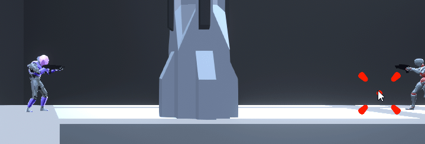
</p>

### The Shotgun
<b>Strengths</b>
<ul>
	<li>High Damage Per Second (DPS)</li>
	<li>High Damage Per Shot</li>
</ul>

<b>Weaknesses</b>
<ul>
	<li>Short Range</li>
	<li>High Bullet Spread</li>
	<li>Low Magazine Size</li>
	<li>Low Rate of Fire</li>
</ul>
<p align="center">
  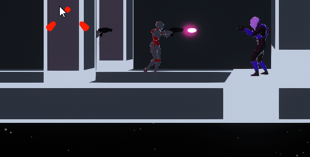
</p>

### The Sub Machine Gun (SMG)
<b>Strengths</b>
<ul>
	<li>High Damage Per Second (DPS)</li>
	<li>High Magazine Size</li>
	<li>High Rate of Fire</li>
</ul>

<b>Weaknesses</b>
<ul>
	<li>Moderate Range</li>
	<li>Moderate Bullet Spread</li>
</ul>
<p align="center">
  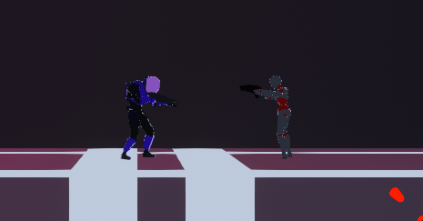
</p>

### The Railgun
<b>Strengths</b>
<ul>
	<li>High Range</li>
	<li>Shots Can Penetrate Enemies</li>
	<li>Low Bullet Spread</li>
</ul>

<b>Weaknesses</b>
<ul>
	<li>Low Rate of Fire</li>
	<li>Low Magazine Size</li>
	<li>Low Damage Per Second (DPS)</li>
<p align="center">
  
</p>

## Abilities
Additionally, the player has access to several abilities which allow for them to exceed what is normally possible.

### Sliding
Causes the player to slide on the ground while running, making the player's hitbox smaller.
<p align="center">
  
</p>

### Wall Jumps
Lets the player jump off a series of opposing walls.
<p align="center">
  
</p>

### Force Field
Creates a spherical ball of energy that surrounds the player, blocking any projectiles that collide with it
<p align="center">
  
</p>

### Projectile Blast
Emits a strong blast of energy which destroys all nearby projectiles.
<p align="center">
  
</p>

## Enemies
There are multiple types of enemies the player will encounter, including sentient AI and turrets. Turrets cannot be destroyed.

### X-BOT
X-BOTs are the weakest form of AI, they will patrol the corridors of the facilities. They will use a pistol to shoot a slow projectile towards the player.
<p align="center">
  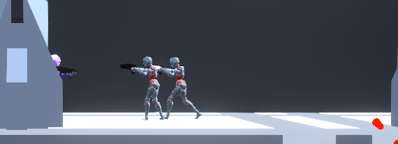
</p>

### Vanguard
Vanguards are stronger, larger, and much more deadly than X-BOTs. These brutes pack an energy infused shotgun which will decimate the player if they get too close.
<p align="center">
  
</p>

### Projectile Turret
These surface bound machines have the capability to rotate 180 degrees around its central axis, attempting to target the player's location at the time of firing. These weapons may not be dangerous on their own, but a whole group of them in one area will sure get the player moving on their feet.
<p align="center">
  
</p>

### Homing Projectile Turret
Similar to the Projectile Turret, these weapons can rotate on their axis, however, they have a smaller limit of rotation. They will fire projectiles which will attempt to chase the player, gaining speed the longer they are in the air.
<p align="center">
  
</p>

### Railgun Turret
These are the types of turrets you always want to be paying attention to. With their enormous barrel, these things can concentrate millions of joules of energy into one centrally focused beam of energy. The turret will always shoot a smaller laser before the blast, indicating to the player that the turret is about fire, allowing for them enough time to react.
<p align="center">
  
</p>

### Crimson
This is what the entire game leads up to, the final boss fight. Crimson is the toughest enemy in the game by far, having several different attack patterns and abilities which will sure put the player's skills to test. The player will have to use everything in their arsenal if they desire to be victorious.
<div class="row">
	<div class="column">
		
	</div>
	<div class="column">
		
	</div>
</div>
<br>
<div class="row">
	<div class="column">
		
	</div>
	<div class="column">
		
	</div>
</div>

## User Interface (UI)
### Main Menu
<i>If opened in the Unity Engine as a developer: go to "Assets\Scenes\MainMenu.unity" to find the initial scene to start the game.</i>

Once the game is opened, the player is sent to the main menu.
<p align="center">
  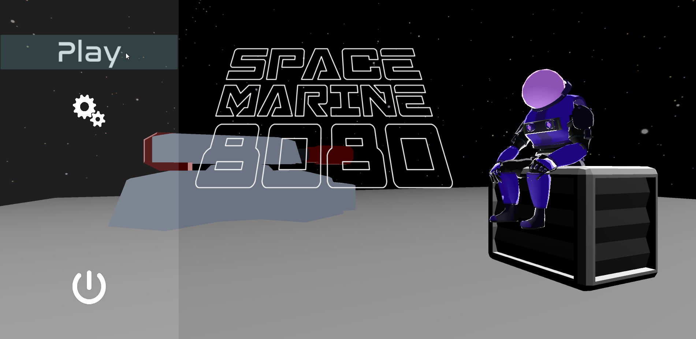
</p>
Here, the player can select ‘Play’, which will bring them to a screne where they can configure what level to play, and the difficulty. The difficulties have the following properties set to the player:
<ul>
	<li>Easy: 50% damage received, 150% damage delt</li>
	<li>Medium: 100% damage received, 100% damage delt</li>
	<li>Hard: 150% damage received, 50% damage delt</li>
</ul>
The player can also choose to play other levels that they are up to / already completed.
<p align="center">
  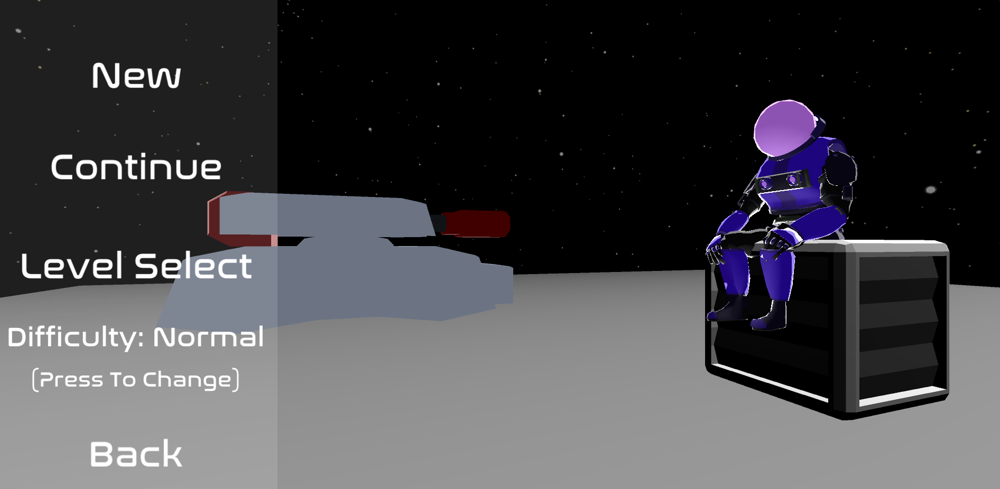
</p>
Additionally, the player can select the gear icon, representing the ‘Options’ page (icon is an example of a mental model).
<p align="center">
  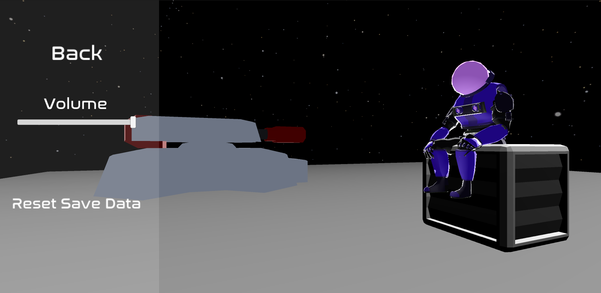
</p>
Here, the player can adjust the volume of the game, as well as reset their save data to a state like when they first play the game.

### Design of Main Menu
The main menu was designed to have a minimalistic, dim rendering of a scene in game, which does not draw the player’s eyes away from the text on the main menu. The brighter and larger text on the left side of the screen supports both younger and older audiences as they are clearly separated from each other, and stand out from the background. Each button applies the principle of infinite edges, which simply states that the user does not need to deaccelerate their mouse to click on the button, as buttons extend all the way to the left edge of the screen. 

### Heads up Display (HUD)
<b>Location of Information</b>
<p align="center">
  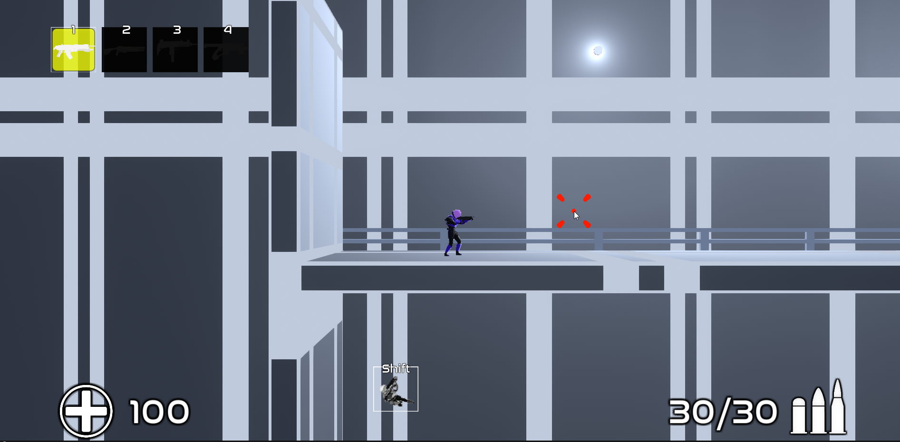
</p>
The HUD was designed so that all of the key information that the player is provided with is on the bottom and top of the screen. This is because most of the action that goes on is in the centre of the screen, and by putting the information in these locations, the gameplay is unlikely to be blocked by it.
<p align="center">
  
</p>
Additionally, some of the levels are designed in a way where the elements of the HUD appear on the walls of the floors and ceilings of the levels (in the image above), where the player does not need to have vision of that space of area at the time.

<b>Colour Design</b>
White was chosen as the colour for the text in the peripherals of the HUD as it’s a good peripheral colour and works well in contrast with the black border that surrounds it. The black border around the icons and text also causes it to stand out from the white/grey background.

The current weapon that the player is holding is highlighted yellow, which is also a strong peripheral colour. This allows for the player to know which weapon they are holding without moving their eyes away from the centre of the screen.

The red colour for the crosshair was chosen as it is an effective colour to have in the centre of the player’s field of view. Since the crosshair is likely to located where the player is looking the most, this will allow for them to keep track of the crosshair more easily.

### User Interaction
Below are some notable features that were implemented into the game to subtlety provide information/feedback to the player whilst they are performing tasks. 

When the player uses an ability, the ability icon goes through a series of animations. The box becomes dark, and slowly fills up until the ability’s cooldown is up. Once it is up, the ability icon flashes on the screen to indicate to the player that the ability is off cooldown, and can be used again.
<p align="center">
  
</p>
When the player receives damage, the outer edges of the screen flash red to notify the player. Red was chosen as it isn’t too distracting in the peripherals of the player’s vision, however is still somewhat noticeable.
<p align="center">
  
</p>
Additionally, when the player hits an enemy, the enemy will flash red and play an audio sound to indicate that the enemy has been hit.
<p align="center">
  
</p>

### Tutorial
Once the player launches the first level through the main menu, the player will provided information which will assist them in learning the basics of the game. Controls for switching weapons and using abilities are always displayed on the HUD.

Throughout the course of the game, the player will receive additional information that will provide information on how to complete the level, as well as explain any new abilities they come across. 
## How to use the game 

If developer: go to "Assets\Scenes\MainMenu.unity" to find the initial scene to start the game.

The program is a unity game. Once launched, click “Play” to be faced with various options. “New game” to start from the first level, “Continue” to start on the level where you last left off, “Level select” to open up a menu of each unlocked level (to unlock a level, one must progress to it through the previous levels). Clicking on “Difficulty” will change the difficulty of the game between Easy, Normal and Hard. 
Easy: 50% Damage taken and 150% Damage done. 
Normal: 100% Damage taken and 100% Damage done. 
Hard: 150% Damage taken and 50% Damage done.
There is also an “Options” button which allows the user to delete all saved data, resetting all level unlocks and forces the user to start from scratch, or adjust the volume.

Once the game is begun, the commander will instruct you of the basics. In the heads-up display, on the bottom left, is the player’s current health. In the bottom middle is a list of the player’s unlocked abilities with their respective key to activate on top. In the bottom right, is the current active weapon’s ammo over max ammo. In the top left, are the weapons the player can use where blacked out weapon icons means the weapon hasn’t been unlocked (found) yet. The weapon icons are paried with a number indicating the key to press to switch to the associated weapon.

## Modelling objects and entities
The turret models, platforms and scenery decorations (crates, columns) are created by Kevin Gao through Blender, kevin.haha@gmail.com. Whilst the weapon models are taken from the asset store. As for the levels, everything was made using Unity’s ProBuilder. For the Player model, it was taken from https://vrcmods.com/item/4352-commando, a website for VRChat avatar models. To match our intended style of the game, we recolored the texture map. To top off the models, every model (gun, enemy, player, ProBuilder objects, etc.) one can find in the game is equipped with one of multiple custom shaders, the phong wireframe shader, the cel shader, the pulse shader and a variation of the pulse shader, the forcefield shader.

As for all the entities (Player, turrets, enemies, etc.), all are placed on the -2.5f value of the z axis with respect to the 2.5D aspect of the game. However, this would lead to some rotation and transform.eulerAngles manipulation as float data types have small errors, especially when modifying eulerAngles, for example 89.999 instead of 90, this may seem small but accumulates quickly and causes the entities to somehow move too far away from the -2.5f value of the z position and cause issues for example, shooting to miss.
To counteract this, in the update frame, the z position of the entity is reassigned to -2.5f every call.

For example, in the enemy patrol script:

```c#
t.position += t.forward * Time.deltaTime * 3f;
t.position = new Vector3(t.position.x, t.position.y, -2.5f);
```

Another issue in modelling the entities, due to using Spherical interpolation on enemy movement, the very end of the interpolation is very gradual and as we do not want the object to move forward while the eulerAngle.y is not 90 (right) and 270 (left), we need to wait for the spherical interpolation to finish, however, for it to perfectly interpolate, it will take significant time, so instead, a quick fix is implemented:

```c#
//Account for slerp errors
if (t.eulerAngles.y > 270 - 10f && t.eulerAngles.y < 270 + 10f && !facingRight)
{
    t.eulerAngles = new Vector3(0f, 270f, 0f);
}
else if (t.eulerAngles.y > 90 - 10f && t.eulerAngles.y < 90 + 10f && facingRight)
{
    t.eulerAngles = new Vector3(0f, 90f, 0f);
}
```

## Camera motion 
As for the camera motion, a simple fixed z coordinate (z dimension is the depth for this game) camera is implemented which essentially chases the player and attempts to focus the player in the center of the camera. To make the game feel more smooth, instead of snapping straight to the player, Spherical interpolation is used to give the camera a “falling behind” feeling while keeping up with the player.

```c#
    public Transform player;
    private Transform cam;
    public float speed = 3f;
    public float camDepth = -17.5f
    void Start()
    {
        cam = this.transform;
    }
    // Update is called once per frame
    void Update()
    {
        //Locate player
        Vector3 moveposition = new Vector3(player.position.x, player.position.y, camDepth);
        //Smoothly center the player
        cam.position = Vector3.Slerp(cam.position, moveposition, Time.deltaTime * speed);
        cam.position = new Vector3(cam.position.x, cam.position.y, moveposition.z);
    }
```
## Graphics pipeline  

Our game works through Unity’s graphics pipeline by working with custom scripts and shaders applied to every visible object. Most of the graphics rendering is done through the GPU programmed with shaders as it is a much more efficient dedicated hardware designed for that type of computing than the CPU. 

Each level has multiple point lights which may vary in colour that needs to be sent into the shader for the GPU. In order to achieve this every object has its own collider and it’s own script which detects up to four lights and sends the information into its shader. Lights are carefully placed to avoid having more than five in one area. There are many versions of this script implemented varying on the type of renderer of the object (skin or mesh) and whether or not the object moves position or is static to save performance. 

In regards to the shaders themselves; there are three main shaders. A phong reflection model shader with a wireframe pass, cell shader which uses an altered phong reflection model and a custom shader for the bubble shield.


## Shaders 

There are three main custom shaders in the game. The first one is a custom phong reflection model wireframe shader. This shader takes in four point light sources (provided by scripts) alongside the surface texture/colour and phong parameters. From this input it applies two passes; the first pass shades the object using normal Phong Reflection with the light source intensity clamped. The vertex shader passes through information required in the pixel/fragment shader to do per pixel shading in this pass.

<b>In the first pass fragment shader:</b>
```c#
 // Calculate ambient RGB intensities
float3 amb = v.color.rgb * UNITY_LIGHTMODEL_AMBIENT.rgb * _Ka;
color.rgb =  amb.rgb * mainTexture.rgb;

float3 L;
float lLength;
float LdotN;
float3 dif;
float3 V;
float3 H;
float3 spe;
float4 lightPosition;
float4 lightColour;

for (int index = 0; index < 4; index++) {
	// Set light position and colour based on 
	lightPosition = float4(_PointLightPositionX[index], _PointLightPositionY[index], _PointLightPositionZ[index], 1.0);
	lightColour = float4(_PointLightReds[index], _PointLightBlues[index], _PointLightGreens[index], 1.0);

	// Calculate diffuse RBG reflections, we save the results of L.N because we will use it again for specular
	L = normalize(lightPosition - v.worldVertex.xyz);
	LdotN = dot(L, interpolatedNormal);
	dif = _fAtt * lightColour.rgb * _Kd * v.color.rgb * saturate(LdotN);

	// clamp power of light based on distance
	lLength = clamp(5/length(lightPosition - v.worldVertex.xyz), 0, 0.45);

	V = normalize(_WorldSpaceCameraPos - v.worldVertex.xyz);
	H = normalize(V + L);

	// Calculate specular
	spe = _fAtt * lightColour.rgb * _Ks * pow(saturate(dot(interpolatedNormal, H)), _specN);

	// Combine Phong illumination model components
	color.rgb += lLength * (dif.rgb + spe.rgb);
}

color.a = 1.0f;
return color;
```
The second pass applies a wireframe to the object to add to the environment’s sci-fi / space aesthetic. In this pass the vertex shader similarly just passes through information but a geometry shader is added to read the edges of each triangle in order to highlight in the fragment shader. The for each triangle; the longest edge is set to be ignored in order to not show diagonal wireframe lines. This shader is mainly applied to the environment such as walls and the ground.

<b>In the second pass geometry shader:</b>
```c#
void geom(triangle vertIn triIn[3], inout TriangleStream<vertOut> triStream) {
	float3 noWire = float3(0., 0., 0.);

	// Define edges length
	float EdgeALength = length(triIn[0].worldPos - triIn[1].worldPos);
	float EdgeBLength = length(triIn[1].worldPos - triIn[2].worldPos);
	float EdgeCLength = length(triIn[2].worldPos - triIn[0].worldPos);

	// Find diagonal line (longest line in triangle)
	if(EdgeALength > EdgeBLength && EdgeALength > EdgeCLength)
		noWire.y = 1.; // edge A
	else if (EdgeBLength > EdgeCLength && EdgeBLength > EdgeALength)
		noWire.x = 1.; // edge B
	else
		noWire.z = 1.; // edge C

	// Remove diagonal wires by setting bary to 1 for each vertex
	vertOut o;
	o.pos = mul(UNITY_MATRIX_VP, triIn[0].worldPos);
	o.bary = float3(1., 0., 0.) + noWire;
	triStream.Append(o);

	o.pos = mul(UNITY_MATRIX_VP, triIn[1].worldPos);
	o.bary = float3(0., 0., 1.) + noWire;
	triStream.Append(o);

	o.pos = mul(UNITY_MATRIX_VP, triIn[2].worldPos);
	o.bary = float3(0., 1., 0.) + noWire;
	triStream.Append(o);
}
```

The next shader is the cell shading shader which modifies the phong reflection model. This one works similarly to the previous phong reflection shader where it takes in four point lights from object scripts and uses a custom pixel and fragment shader. However to create a cell shaded effect the diffuse is limited to 0 and 1 instead of a smooth gradient and a sharp rim/outline is applied using a view direction vector. This shader is applied to characters such as the player, enemies, turret and some environmental objects to create a more cartoony look to the models.

<b>Diffuse calculation within fragment shader:</b>
```c#
// Calculate diffuse RBG reflections, we save the results of L.N because we will use it again for specular
L = normalize(lightPosition - v.worldVertex.xyz);
LdotN = dot(L, interpolatedNormal);
// Limit L.N to 0 & 1 to create cell shading effect
LdotN = saturate(LdotN) > 0 ? 1 : 0;
dif = _fAtt * lightColour.rgb * _Kd * saturate(LdotN); // * v.color.rgb;
V = normalize(_WorldSpaceCameraPos - v.worldVertex.xyz);
H = normalize(V + L);
```

As for the scripts to pass light information onto the shader, 3 types of similar scripts, "Light to shader static", "Light to shader skin", "Light to shader non-skin" are used.

"Light to shader static" only checks the light information once at void Start() since the object is assumed to be static.

"Light to shader skin" and "Light to shader non-skin" checks for light sources in void Update(), essentially checking up to 4 lights in a specified radius every Update(), therefore these scripts are used for moving objects, for example, the player, the enemy and turret barrels.
"Skin" is for Skinned mesh renderers while "Non-skin" is for normal mesh renderers.

The scripts detect lights this way, note that the Vector3 "naught" represents a location very far away from where any light source can be, essentially negating any impact of the "fake" light onto the shader lighting calculations.
```c#
int i = 0;
Collider[] locatedLights = Physics.OverlapSphere(player.position, sphereSize, lightLayer);
float[] positionX = new float[maxLights];
float[] positionY = new float[maxLights];
float[] positionZ = new float[maxLights];
Vector4[] colours = new Vector4[maxLights];
foreach (var collider in locatedLights)
{
    if (i > 3)
    {
	break;
    }
    Transform light = collider.transform;
    positionX[i] = light.position.x;
    positionY[i] = light.position.y;
    positionZ[i] = light.position.z;
    colours[i] = collider.GetComponent<Light>().color;
    i++;
}
if (i < 3)
{
    while (i < 3)
    {
	positionX[i] = naught.x;
	positionY[i] = naught.y;
	positionZ[i] = naught.z;
	colours[i] = new Vector4(0.0f, 0.0f, 0.0f, 1.0f);
	i++;
    }
}
```
Monobehaviour script to pass light information onto shader

## Evaluation 
As for the evaluation part of the game, we decided to utilize the <b>"Think Aloud"</b> observation method, this is because we will be able to understand what the user is feeling while playing the game, any signs of stress or confusion can be noted down and analysed to locate the flaws of the software and improve on it. In addition a questionnaire was given to the participants for the querying section of the evaluation. The questionnaire focuses on the friendliness of the user interface and heads-up display, the clarity of the objective of the game, balancing of the game elements (player weapons and level difficulty increase rate), the friendliness of the controls and requests for any bug reports.
The questionnaire can be found here:
https://forms.gle/vT7nAQWQCxUX2znr5

<b>Evaluation subjects</b>
We performed Think Aloud observation method analysis on a total of 9 people, the demographic of these people are in the age range between 19-23, young adults, there were 8 male participants and 1 female participant.
The participants were instructed to load up the game and play the entire game through clicking New Game, the participants were expected to finish every level in consecutive order. Rest breaks were allowed as we have implemented a pause menu and a "Continue" button in the main menu. The participants gameplay along with their voice and the evaluater's voice was recorded as a video using OBS and brought together to be analysed as a group. In addition, the evaluater utilised "paper and pencil" to note down any significant statements or remarks made by the participant as well as any bugs or issues and suggestions found and given by the participant. As the evaluater cannot capture all the information live, the recording proved fruitful in gathering useful information that was skipped over or not noted down.

<b>Feedback</b>
In general the game was well recieved. 33% found the game "Average", while 33% found the game "Fun" and 33% found the game "Very Fun", from this, we can infer that the game was at least somewhat enjoyable for the participants.
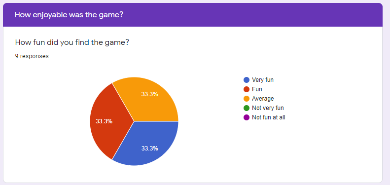

At first, the user interface of the game as well as the heads-up display proved to be somewhat poorly designed; evaluation 1, 2 and 3 all suggested that the in game HUD needs to be more indicative of what ability is off cooldown and what gun their using. According to this information, we improved the user interface (which will be explained in the next section) and this is backed up by all of the participants who were evaluated later voting for "Slightly Agree" and "Agree" to the statement: <i>"I found the game interface/UI friendly and easy to understand. (Eg. Icons are very clear in what they do)</i>

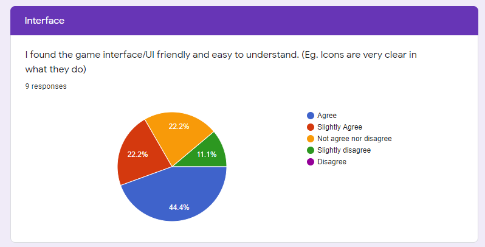

Note that the first 3 participants who were exposed to the early user interface voted only for "Not agree nor disgree" and "Disagree".

The game instructions were clear and the query results prove this:

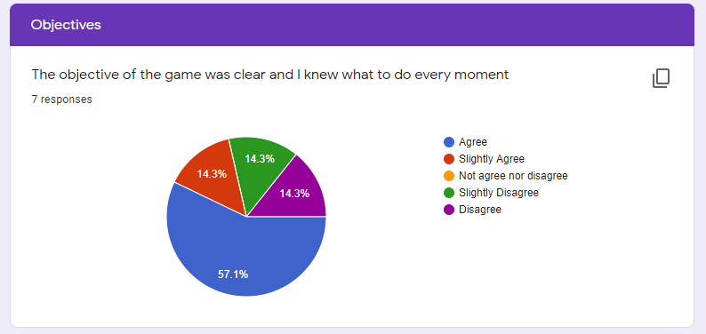

One issue we had was the balacing of the elements of the game, according to the participants' suggestions and comments during Think Aloud evaluation as well as the questionnaire. Level 4 (Second last level) proved to be a great challenge to beat in comparison to the other levels (this issue was addressed and fixed, next section for more information). Another unbalanced element are the weapons the player unlocks. In the Think Aloud observation, the shotgun was only used once every time (that is when it was first picked up) and never used again after. While, the SMG was often the most used weapon in the game. The questionnaire results back this claim up:

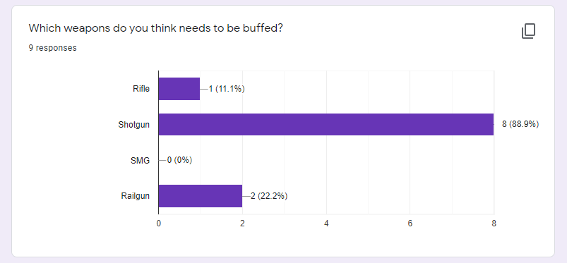

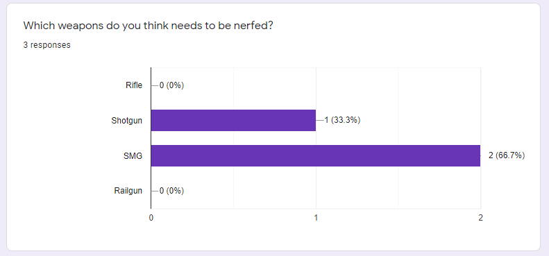

