**The University of Melbourne**
# COMP30019 – Graphics and Interaction

### Group 10's Game: Space Marine 8080

<p align="center">
	
</p>

### [Video Trailer](https://www.youtube.com/watch?v=AM5vhYM9AzE)

If developer: go to "Assets\Scenes\MainMenu.unity" to find the initial scene to start the game.


## Table of contents
* [Team Members](#team-members)
* [Contributers](#contributers)
* [Technologies](#technologies)
* [Description](#description)
* [Synopsis](#synopsis)
* [Weapons](#weapons)
* [Abilities](#abilities)
* [Enemies](#enemies)
* [User Interface](#user-interface)
* [How to use the game](#how-to-use-the-game)
* [Modelling objects and entities](#modelling-objects-and-entities)
* [Camera motion](#camera-motion)
* [Graphics pipeline](#graphics-pipeline)
* [Shaders](#shaders)
* [Evaluation](#evaluation)

## Team Members

| Name | Task | State |
| :---         |     :---:      |          ---: |
| Timmy Truong  | Shaders, Video Editing, Interface, Lighting and README     ||
| Nathan Rearick    | Movement System, Abilities, Game Concept Design, Evaluation, Bug Catcher     ||
| Lucien Lu    | Level design, Turrets/Projectiles, AI, Main Menu, Camera, Abilities, Special Movement, Guns, UI      ||

## Contributers

| | Contributer | Contribution | Email | Other |
|---|---|---|---|---|
| <p align="center"></p> | <b>Kevin Gao</b> | Turret and map assets modelling | kevin.haha@gmail.com | Instagram: https://www.instagram.com/keving_win98se/ |

## Technologies
Project is created with:
* Unity 2019.4.3f1

## Description
Space Marine 8080 is a 2.5D platformer inspired by the game 'My Friend Pedro', where the main objective of the game is to shoot, move and reach the end of each level in style. The versatility and freedom that is offered to the player allows for them to play their own way, as there is no 'correct' way to complete a level.

## Synopsis
You are Marine 8080, a newly recruited private, enrolled into the Special Space Marine Force. Your objective is to navigate throughout the 6 uniquely designed locations from start to the finish, activating every radar you come across. Of course, the opposition will not let you succeed so easily, as a scouting survey of the area reports that the facility is well armed, additionally indicating that a large source of energy is radiating from the centre.

You will have to be careful, as the human body can only tolerate so much damage. Run, jump and slide out of the barrage of ammunition that will be thrown at you. Don’t forget to take advantage of the arsenal of weapons and abilities that you will come across, you never know what could lie ahead of you.

## Weapons
The player has access to 4 different weapons, all with different strengths and weaknesses, allowing for the player to choose a playstyle or adapt to their environment.
### The Rifle
<b>Strengths</b>
<ul>
	<li>Long Range</li>
	<li>Moderate Rate of Fire</li>
	<li>Moderate Magazine Size</li>
	<li>Low Bullet Spread</li>
</ul>

<b>Weaknesses</b>
<ul>
	<li>Low Damage Per Second (DPS)</li>
	<li>Low Damage Per Shot</li>
</ul>
<p align="center">
  
</p>

### The Shotgun
<b>Strengths</b>
<ul>
	<li>High Damage Per Second (DPS)</li>
	<li>High Damage Per Shot</li>
</ul>

<b>Weaknesses</b>
<ul>
	<li>Short Range</li>
	<li>High Bullet Spread</li>
	<li>Low Magazine Size</li>
	<li>Low Rate of Fire</li>
</ul>
<p align="center">
  
</p>

### The Sub Machine Gun (SMG)
<b>Strengths</b>
<ul>
	<li>High Damage Per Second (DPS)</li>
	<li>High Magazine Size</li>
	<li>High Rate of Fire</li>
</ul>

<b>Weaknesses</b>
<ul>
	<li>Moderate Range</li>
	<li>Moderate Bullet Spread</li>
</ul>
<p align="center">
  
</p>

### The Railgun
<b>Strengths</b>
<ul>
	<li>High Range</li>
	<li>Shots Can Penetrate Enemies</li>
	<li>Low Bullet Spread</li>
</ul>

<b>Weaknesses</b>
<ul>
	<li>Low Rate of Fire</li>
	<li>Low Magazine Size</li>
	<li>Low Damage Per Second (DPS)</li>
<p align="center">
  
</p>

## Abilities
Additionally, the player has access to several abilities which allow for them to exceed what is normally possible.

### Sliding
Causes the player to slide on the ground while running, making the player's hitbox smaller.
<p align="center">
  
</p>

### Wall Jumps
Lets the player jump off a series of opposing walls.
<p align="center">
  
</p>

### Force Field
Creates a spherical ball of energy that surrounds the player, blocking any projectiles that collide with it
<p align="center">
  
</p>

### Projectile Blast
Emits a strong blast of energy which destroys all nearby projectiles.
<p align="center">
  
</p>

## Enemies
There are multiple types of enemies the player will encounter, including sentient AI and turrets. Turrets cannot be destroyed.

### X-BOT
X-BOTs are the weakest form of AI, they will patrol the corridors of the facilities. They will use a pistol to shoot a slow projectile towards the player.
<p align="center">
  
</p>

### Vanguard
Vanguards are stronger, larger, and much more deadly than X-BOTs. These brutes pack an energy infused shotgun which will decimate the player if they get too close.
<p align="center">
  
</p>

### Projectile Turret
These surface bound machines have the capability to rotate 180 degrees around its central axis, attempting to target the player's location at the time of firing. These weapons may not be dangerous on their own, but a whole group of them in one area will sure get the player moving on their feet.
<p align="center">
  
</p>

### Homing Projectile Turret
Similar to the Projectile Turret, these weapons can rotate on their axis, however, they have a smaller limit of rotation. They will fire projectiles which will attempt to chase the player, gaining speed the longer they are in the air.
<p align="center">
  
</p>

### Railgun Turret
These are the types of turrets you always want to be paying attention to. With their enormous barrel, these things can concentrate millions of joules of energy into one centrally focused beam of energy. The turret will always shoot a smaller laser before the blast, indicating to the player that the turret is about fire, allowing for them enough time to react.
<p align="center">
  
</p>

### Crimson
This is what the entire game leads up to, the final boss fight. Crimson is the toughest enemy in the game by far, having several different attack patterns and abilities which will sure put the player's skills to test. The player will have to use everything in their arsenal if they desire to be victorious.
<div class="row">
	<div class="column">
		
	</div>
	<div class="column">
		
	</div>
</div>
<br>
<div class="row">
	<div class="column">
		
	</div>
	<div class="column">
		
	</div>
</div>

## User Interface
### Main Menu
<i>If opened in the Unity Engine as a developer: go to "Assets\Scenes\MainMenu.unity" to find the initial scene to start the game.</i>

Once the game is opened, the player is sent to the main menu.
<p align="center">
  
</p>
Here, the player can select ‘Play’, which will bring them to a screne where they can configure what level to play, and the difficulty. The difficulties have the following properties set to the player:
<ul>
	<li>Easy: 50% damage received, 150% damage delt</li>
	<li>Medium: 100% damage received, 100% damage delt</li>
	<li>Hard: 150% damage received, 50% damage delt</li>
</ul>
The player can also choose to play other levels that they are up to / already completed.
<p align="center">
  
</p>
Additionally, the player can select the gear icon, representing the ‘Options’ page (icon is an example of a mental model).
<p align="center">
  
</p>
Here, the player can adjust the volume of the game, as well as reset their save data to a state like when they first play the game.

### Design of Main Menu
The main menu was designed to have a minimalistic, dim rendering of a scene in game, which does not draw the player’s eyes away from the text on the main menu. The brighter and larger text on the left side of the screen supports both younger and older audiences as they are clearly separated from each other, and stand out from the background. Each button applies the principle of infinite edges, which simply states that the user does not need to deaccelerate their mouse to click on the button, as buttons extend all the way to the left edge of the screen. 

### Heads up Display (HUD)
<b>Location of Information</b>
<p align="center">
  
</p>
The HUD was designed so that all of the key information that the player is provided with is on the bottom and top of the screen. This is because most of the action that goes on is in the centre of the screen, and by putting the information in these locations, the gameplay is unlikely to be blocked by it.
<p align="center">
  
</p>
Additionally, some of the levels are designed in a way where the elements of the HUD appear on the walls of the floors and ceilings of the levels (in the image above), where the player does not need to have vision of that space of area at the time.

<b>Colour Design</b>
White was chosen as the colour for the text in the peripherals of the HUD as it’s a good peripheral colour and works well in contrast with the black border that surrounds it. The black border around the icons and text also causes it to stand out from the white/grey background.

The current weapon that the player is holding is highlighted yellow, which is also a strong peripheral colour. This allows for the player to know which weapon they are holding without moving their eyes away from the centre of the screen.

The red colour for the crosshair was chosen as it is an effective colour to have in the centre of the player’s field of view. Since the crosshair is likely to located where the player is looking the most, this will allow for them to keep track of the crosshair more easily.

### User Interaction
Below are some notable features that were implemented into the game to subtlety provide information/feedback to the player whilst they are performing tasks. 

When the player uses an ability, the ability icon goes through a series of animations. The box becomes dark, and slowly fills up until the ability’s cooldown is up. Once it is up, the ability icon flashes on the screen to indicate to the player that the ability is off cooldown, and can be used again.
<p align="center">
  
</p>
When the player receives damage, the outer edges of the screen flash red to notify the player. Red was chosen as it isn’t too distracting in the peripherals of the player’s vision, however is still somewhat noticeable.
<p align="center">
  
</p>
Additionally, when the player hits an enemy, the enemy will flash red and play an audio sound to indicate that the enemy has been hit.
<p align="center">
  
</p>

### Tutorial
Once the player launches the first level through the main menu, the player will provided information which will assist them in learning the basics of the game. Controls for switching weapons and using abilities are always displayed on the HUD.
<p align="center">
  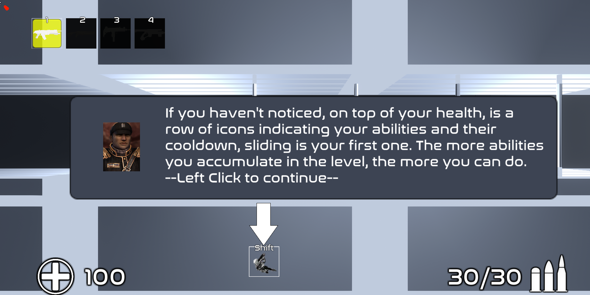
</p>
Throughout the course of the game, the player will receive additional information that will provide information on how to complete the level, as well as explain any new abilities they come across. 
<p align="center">
  
</p>
<p align="center">
  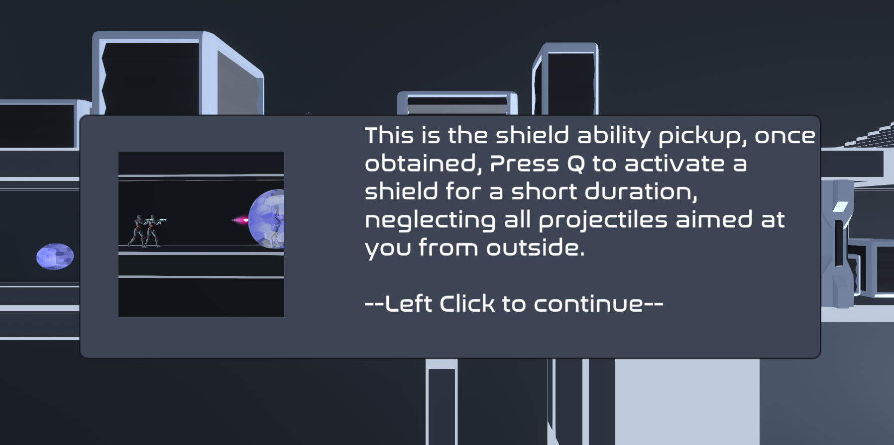
</p>

## How to use the game 

If developer: go to "Assets\Scenes\MainMenu.unity" to find the initial scene to start the game.

The program is a unity game. Once launched, click “Play” to be faced with various options. “New game” to start from the first level, “Continue” to start on the level where you last left off, “Level select” to open up a menu of each unlocked level (to unlock a level, one must progress to it through the previous levels). Clicking on “Difficulty” will change the difficulty of the game between Easy, Normal and Hard. 
Easy: 50% Damage taken and 150% Damage done. 
Normal: 100% Damage taken and 100% Damage done. 
Hard: 150% Damage taken and 50% Damage done.
There is also an “Options” button which allows the user to delete all saved data, resetting all level unlocks and forces the user to start from scratch, or adjust the volume.

Once the game is begun, the commander will instruct you of the basics. In the heads-up display, on the bottom left, is the player’s current health. In the bottom middle is a list of the player’s unlocked abilities with their respective key to activate on top. In the bottom right, is the current active weapon’s ammo over max ammo. In the top left, are the weapons the player can use where blacked out weapon icons means the weapon hasn’t been unlocked (found) yet. The weapon icons are paried with a number indicating the key to press to switch to the associated weapon.

## Modelling objects and entities
The turret models, platforms and scenery decorations (crates, columns) are created by Kevin Gao through Blender, whilst the weapon models are taken from the asset store.The level layouts were made using Unity’s ProBuilder. The player model was taken from https://vrcmods.com/item/4352-commando, a website for VRChat avatar models. To match our intended style of the game, we recoloured the texture map of the player. To top off the models, every model (gun, enemy, player, ProBuilder objects, etc.) in the game is equipped with one of multiple custom shaders, the phong wireframe shader, the cel shader, variations of a pulse shader, and a forcefield shader.

All of the entities (Player, turrets, enemies, etc.), are placed on the -2.5f value of the z axis in the game. Since we want all entities to remain on the same z value, this would cause some issues with their rotation as the small errors in calculations that occur with floats accumulate over time, causing the z position to slowly change over time, causing some entities to walk off. This problem was solved by manually reassigning the z position back to its original value every time a euler angle calculation was made, and the angle is rounded to the nearest direction (left or right).

For example, in the enemy patrol script:

```c#
t.position += t.forward * Time.deltaTime * 3f;
t.position = new Vector3(t.position.x, t.position.y, -2.5f);
```

Another issue with handling the entities is due to using spherical interpolation on enemy movement. Due to the nature of spherical interpolation (asymptotic properties), the process would take to long to completely rotate an entity, since the change in rotation towards the end is almost unnoticeable. Since we want the entity to move right after rotating, we want to clamp the rotation to the nearest direction (left or right) instead of waiting for the spherical interpolation to finish. This processes removes the long pause after the rotation, before the entity begins moving again. 

```c#
//Account for slerp errors
if (t.eulerAngles.y > 270 - 10f && t.eulerAngles.y < 270 + 10f && !facingRight)
{
    t.eulerAngles = new Vector3(0f, 270f, 0f);
}
else if (t.eulerAngles.y > 90 - 10f && t.eulerAngles.y < 90 + 10f && facingRight)
{
    t.eulerAngles = new Vector3(0f, 90f, 0f);
}
```
As for how the objects and entities (player and enemies and turrets) interact with each other. The player is able to fire bullets at the enemies through Unity’s Physics.Raycast and Physics.RaycastAll for penetration. The player casts off a ray in the direction the cursor is facing fixed on the z axis (the depth). If the ray hits an enemy, the script uses GetComponent on the collider to grab the health script for the enemy and call the public Damage() method which causes it to take damage.
```c#
        mouseWorld = lm.mouseWorld;
        Vector3 adjustedBarrelEnd = new Vector3(barrelEnd.position.x, barrelEnd.position.y, -2.5f);
        Quaternion targetRot = chest.rotation;
        targetRot = Quaternion.Euler(new Vector3(targetRot.eulerAngles.x, lm.playerIsRight ? 270f : 90f, 0f));
        float hitDistance = rifleDist;
        Vector3 targetDir = (targetRot * Vector3.forward).normalized;
        Vector3 target = shootingOrigin.position + targetDir * rifleDist;
        GameObject tracer = Instantiate(tracerRenderer, shootingOrigin.position, Quaternion.identity);
        LineRenderer lr = tracer.GetComponent<LineRenderer>();

        RaycastHit hit;
        if (Physics.Raycast(shootingOrigin.position, targetDir, out hit, rifleDist, layerMask))
        {
            if (hit.transform.tag == "Enemy")
            {
                hit.transform.gameObject.GetComponent<HealthSystem>().Damage(10f / difficulty);
            }
            else if (hit.transform.tag == "Boss")
            {
                hit.transform.gameObject.GetComponent<HealthSystemBoss>().Damage(10f / difficulty);
            }
            hitDistance = hit.distance;
            target = hit.point;
        }
```

This is of course not one sided, the enemy can shoot back at the player. However, to make it more friendly and playable, instead of raycasting, which is instant, the enemies fire a slow moving projectile which on collision with the player,  uses GetComponent to grab the health script for the player and damage him/her. However, for the enemies to be able to shoot at the player, they must be able to see the player and face him/her. Thus, raycasting is used to check if the line of sight between the enemy and the player is obstructed as well as if the player is in range of the enemy, if both these conditions are met, the enemy will attempt to shoot at the player.
```c#
        if ((player.position - t.position).magnitude < 1.5f)
        {
            anim.SetBool("playerInRange", true);
            inRange = true;
            CheckRotation();
        }
        //Cast two rays, one for player sliding and one for player standing
        else if (!playerslide.isSliding && (Physics.Raycast(t.position, dirToLook, out hit, Mathf.Infinity, layerMask)) || (playerslide.isSliding && Physics.Raycast(t.position, slideDirToLook, out hit, Mathf.Infinity, layerMask)))
        {
            //If player is in range and the raycast hits the player, meaning the player is in view, follow the player
            if ((player.position - t.position).magnitude < spotRange && hit.transform.tag == "Player")
            {
                anim.SetBool("playerInRange", true);
                inRange = true;
                CheckRotation();
                if (turningTimer <= 0)
                {
                    FollowPlayer();
                }
                else
                {
                    turningTimer -= Time.deltaTime;
                }
                timer = -1f;
            }
            else
            {
                inRange = false;
                Patrol();
                anim.SetBool("Stop", false);
                anim.SetBool("playerInRange", false);
            }
        }
```
As for turrets, the interaction is one sided, the player cannot do anything to the turret, eg. harm or destroy the turrets. However, the turrets can fire at the player at will, using both raycasts (Railgun) and projectiles like the damageable enemies’ projectiles to harm the player. Like the damageable enemies detection of the player, turrets are given a range in which the player must be within for the turret to detect, the turrets’ player detection also have a minimum/maximum height as the barrel cannot rotate too low/high. Finally a raycast is used to check if the line of sight between the player and the turret is not obstructed. If all these conditions are met, the turret will attempt to shoot at the player. 

<b>Extracted from R2Turret script:</b>
```c#
    public bool SearchPlayer()
    {
        Vector3 turretToPlayer;

        //Account for sliding hitbox depending on if the player is sliding or not
        dirToLook = player.position - t.position;
        slideDirToLook = new Vector3(player.position.x, player.position.y - 1f, player.position.z) - t.position;
        if (!playerslide.isSliding)
        {
            turretToPlayer = dirToLook;
        }
        else
        {
            turretToPlayer = slideDirToLook;
        }
        RaycastHit hit;
        //Try to detect player through raycast
        if (CheckHeight() && turretToPlayer.magnitude <= range && Physics.Raycast(t.position, turretToPlayer, out hit, Mathf.Infinity, playerLayer))
        {
            if (hit.collider.tag == "Player")
            {
                return true;
            }
        }
        return false;
    }
```
The boss (Crimson) is a special case of an enemy, utilising 4 different moves, 2 which uses projectile firing which checks collision with the player to harm him/her. Another 2 moves uses locally static objects as hitbox checkers to identify if the player is in the specified dimensions on the intended moment of harming the player to damage him/her. The laser uses special raycasting, due to the visual effect of the laser being quick big (wide), the perpendicular vector to the original center raycast of the laser is obtained to cast 2 more parallel rays to the original ray offset by the perpendicular vector. Using all three rays, the laser attempts to detect the player in any of these rays and if at least one detects the player, the laser damages the player.

<b>Use of perpendicular vectors to get parallel:</b>
```c#
        //Since the laser is wide, use 2 parallel raycasts through the perpendicular ray vector
        Vector3 perp = Vector3.Cross(lookDir, Vector3.up).normalized;
        perp = new Vector3(perp.z, perp.y, perp.x);
        RaycastHit hit;
        //Check three parallel raycasts for player
        if (Physics.Raycast(laserOrigin, lookDir, out hit, Mathf.Infinity, groundPlayer))
        {
            Debug.Log(hit.collider.tag);
            if (hit.collider.tag == "Player")
            {
                playerhit = true;
            }
        }
        if (Physics.Raycast(laserOrigin + 0.75f * perp, lookDir, out hit, Mathf.Infinity, groundPlayer))
        {
            Debug.Log(hit.collider.tag);
            if (hit.collider.tag == "Player")
            {
                playerhit = true;
            }
        }
        if (Physics.Raycast(laserOrigin - 0.75f * perp, lookDir, out hit, Mathf.Infinity, groundPlayer))
        {
            Debug.Log(hit.collider.tag);
            if (hit.collider.tag == "Player")
            {
                playerhit = true;
            }
        }
        if (playerhit)
        {
            pH.Damage(laserDamage);
        }
```
## Camera motion 
As for the camera motion, a simple fixed z coordinate (z dimension is the depth for this game) camera is implemented which essentially chases the player and attempts to focus the player in the center of the camera. To make the game feel more smooth, instead of snapping straight to the player, Spherical interpolation is used to give the camera a “falling behind” feeling while keeping up with the player.

```c#
    public Transform player;
    private Transform cam;
    public float speed = 3f;
    public float camDepth = -17.5f
    void Start()
    {
        cam = this.transform;
    }
    // Update is called once per frame
    void Update()
    {
        //Locate player
        Vector3 moveposition = new Vector3(player.position.x, player.position.y, camDepth);
        //Smoothly center the player
        cam.position = Vector3.Slerp(cam.position, moveposition, Time.deltaTime * speed);
        cam.position = new Vector3(cam.position.x, cam.position.y, moveposition.z);
    }
```
## Graphics pipeline  

Our game works through Unity’s graphics pipeline by working with custom scripts and shaders applied to every visible object. Most of the graphics rendering is done through the GPU programmed with shaders as it is a much more efficient dedicated hardware designed for that type of computing than the CPU. 

Each level has multiple point lights which may vary in colour that needs to be sent into the shader for the GPU. In order to achieve this every object has its own collider and it’s own script which detects up to four lights and sends the information into its shader. Lights are carefully placed to avoid having more than five in one area. There are many versions of this script implemented varying on the type of renderer of the object (skin or mesh) and whether or not the object moves position or is static to save performance. 

In regards to the shaders themselves; there are three main shaders. A phong reflection model shader with a wireframe pass, cell shader which uses an altered phong reflection model and a custom shader for the bubble shield.


## Shaders 

There are three main custom shaders in the game. The first one is a custom phong reflection model wireframe shader. This shader takes in four point light sources (provided by scripts) alongside the surface texture/colour and phong parameters. From this input it applies two passes; the first pass shades the object using normal Phong Reflection with the light source intensity clamped. The vertex shader passes through information required in the pixel/fragment shader to do per pixel shading in this pass.

<b>In the first pass fragment shader:</b>
```c#
 // Calculate ambient RGB intensities
float3 amb = v.color.rgb * UNITY_LIGHTMODEL_AMBIENT.rgb * _Ka;
color.rgb =  amb.rgb * mainTexture.rgb;

float3 L;
float lLength;
float LdotN;
float3 dif;
float3 V;
float3 H;
float3 spe;
float4 lightPosition;
float4 lightColour;

for (int index = 0; index < 4; index++) {
	// Set light position and colour based on 
	lightPosition = float4(_PointLightPositionX[index], _PointLightPositionY[index], _PointLightPositionZ[index], 1.0);
	lightColour = float4(_PointLightReds[index], _PointLightBlues[index], _PointLightGreens[index], 1.0);

	// Calculate diffuse RBG reflections, we save the results of L.N because we will use it again for specular
	L = normalize(lightPosition - v.worldVertex.xyz);
	LdotN = dot(L, interpolatedNormal);
	dif = _fAtt * lightColour.rgb * _Kd * v.color.rgb * saturate(LdotN);

	// clamp power of light based on distance
	lLength = clamp(5/length(lightPosition - v.worldVertex.xyz), 0, 0.45);

	V = normalize(_WorldSpaceCameraPos - v.worldVertex.xyz);
	H = normalize(V + L);

	// Calculate specular
	spe = _fAtt * lightColour.rgb * _Ks * pow(saturate(dot(interpolatedNormal, H)), _specN);

	// Combine Phong illumination model components
	color.rgb += lLength * (dif.rgb + spe.rgb);
}

color.a = 1.0f;
return color;
```
The second pass applies a wireframe to the object to add to the environment’s sci-fi / space aesthetic. In this pass the vertex shader similarly just passes through information but a geometry shader is added to read the edges of each triangle in order to highlight in the fragment shader. The for each triangle; the longest edge is set to be ignored in order to not show diagonal wireframe lines. This shader is mainly applied to the environment such as walls and the ground.

<p align="center">
  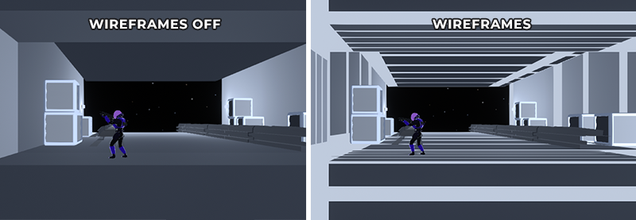
</p>

<b>In the second pass geometry shader:</b>
```c#
void geom(triangle vertIn triIn[3], inout TriangleStream<vertOut> triStream) {
	float3 noWire = float3(0., 0., 0.);

	// Define edges length
	float EdgeALength = length(triIn[0].worldPos - triIn[1].worldPos);
	float EdgeBLength = length(triIn[1].worldPos - triIn[2].worldPos);
	float EdgeCLength = length(triIn[2].worldPos - triIn[0].worldPos);

	// Find diagonal line (longest line in triangle)
	if(EdgeALength > EdgeBLength && EdgeALength > EdgeCLength)
		noWire.y = 1.; // edge A
	else if (EdgeBLength > EdgeCLength && EdgeBLength > EdgeALength)
		noWire.x = 1.; // edge B
	else
		noWire.z = 1.; // edge C

	// Remove diagonal wires by setting bary to 1 for each vertex
	vertOut o;
	o.pos = mul(UNITY_MATRIX_VP, triIn[0].worldPos);
	o.bary = float3(1., 0., 0.) + noWire;
	triStream.Append(o);

	o.pos = mul(UNITY_MATRIX_VP, triIn[1].worldPos);
	o.bary = float3(0., 0., 1.) + noWire;
	triStream.Append(o);

	o.pos = mul(UNITY_MATRIX_VP, triIn[2].worldPos);
	o.bary = float3(0., 1., 0.) + noWire;
	triStream.Append(o);
}
```

The next shader is the cell shading shader which modifies the phong reflection model. This one works similarly to the previous phong reflection shader where it takes in four point lights from object scripts and uses a custom pixel and fragment shader. However to create a cell shaded effect the diffuse is limited to 0 and 1 instead of a smooth gradient and a sharp rim/outline is applied using a view direction vector. This shader is applied to characters such as the player, enemies, turret and some environmental objects to create a more cartoony look to the models.

<p align="center">
  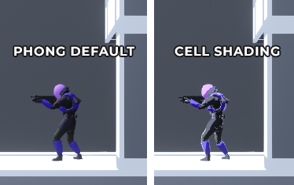
</p>

<b>Diffuse calculation within fragment shader:</b>
```c#
// Calculate diffuse RBG reflections, we save the results of L.N because we will use it again for specular
L = normalize(lightPosition - v.worldVertex.xyz);
LdotN = dot(L, interpolatedNormal);
// Limit L.N to 0 & 1 to create cell shading effect
LdotN = saturate(LdotN) > 0 ? 1 : 0;
dif = _fAtt * lightColour.rgb * _Kd * saturate(LdotN); // * v.color.rgb;
V = normalize(_WorldSpaceCameraPos - v.worldVertex.xyz);
H = normalize(V + L);
```

The pulse, or forcefield (takes in a texture intended to be a grey scale hexagon texture), which takes in the vertices in object space and transforms it into clip space position to be passed into the fragment shader. Then the fragment shader calculates the distance of each pixel’s x coordinate from the center and uses a absolute sin function to create a pulsing effect. The texture is a greyscale texture therefore, a single color component, in this case red can be used to calculate the greyness of the hexagon and adjust each pixel’s noise.

```c#
    fixed4 frag (vertexOut i) : COLOR
    {
	float horizontalDist = abs(i.objPosition.x);
	fixed4 hexagons = tex2D(_HexagonTex, i.uv);
	//Calculate the noise
	float noise = abs(sin(_Time.y*_PulseSpeed - horizontalDist.x*_PulseObjScale + hexagons.r));
	//Calculate pulse color
	fixed4 hexagonPulse = hexagons * _PulseIntensity * noise;
	fixed4 color;
	color.rgb = _Color.rgb + hexagonPulse.rgb*noise;
	color.a = _Color.a;

	return color;
    }
```
As for the scripts to pass light information onto the shader, 3 types of similar scripts, "Light to shader static", "Light to shader skin", "Light to shader non-skin" are used.

"Light to shader static" only checks the light information once at void Start() since the object is assumed to be static.

"Light to shader skin" and "Light to shader non-skin" checks for light sources in void Update(), essentially checking up to 4 lights in a specified radius every Update(), therefore these scripts are used for moving objects, for example, the player, the enemy and turret barrels.
"Skin" is for Skinned mesh renderers while "Non-skin" is for normal mesh renderers.

The scripts detect lights this way, note that the Vector3 "naught" represents a location very far away from where any light source can be, essentially negating any impact of the "fake" light onto the shader lighting calculations.
```c#
int i = 0;
Collider[] locatedLights = Physics.OverlapSphere(player.position, sphereSize, lightLayer);
float[] positionX = new float[maxLights];
float[] positionY = new float[maxLights];
float[] positionZ = new float[maxLights];
Vector4[] colours = new Vector4[maxLights];
foreach (var collider in locatedLights)
{
    if (i > 3)
    {
	break;
    }
    Transform light = collider.transform;
    positionX[i] = light.position.x;
    positionY[i] = light.position.y;
    positionZ[i] = light.position.z;
    colours[i] = collider.GetComponent<Light>().color;
    i++;
}
if (i < 3)
{
    while (i < 3)
    {
	positionX[i] = naught.x;
	positionY[i] = naught.y;
	positionZ[i] = naught.z;
	colours[i] = new Vector4(0.0f, 0.0f, 0.0f, 1.0f);
	i++;
    }
}
```
Monobehaviour script to pass light information onto shader

## Evaluation 
As for the evaluation part of the game, we decided to utilize the <b>"Cooperative Evaluation"</b> observation method, which is a variation on the <b>"Think Aloud"</b> method. This method was chosen as it will allow us to understand what the user is feeling while playing the game, and any signs of stress or confusion can be noted down to be analysed later on. The game was distributed to 9 participants (8 male, 1 female), all within the age range of 19-23. These individuals all fell into our target demographic, which were young people with some gaming experience. 

During each session, the individual was told to screen share their application through Discord. Each session was recorded so that we could replay the footage to reproduce any bugs that they encounter, which makes the process of fixing them easier. 

### Observation Technique
One of the advantages of this technique is that it is like an ongoing discussion between two people. It allows for both parties to ask questions, so that we can answer questions if they need assistance, and we can ask them questions so that we can understand their though process while playing. Some questions that were asked while they were playing were, "What part of the level are you struggling with the most?" and "Where do you think you need to go next?". These questions allow for us to identify particilar sections that may be too 'unbalanced' with the rest of the level, or sections where the player is confused on what to do. Another advantage that this method has is that the play tester is encouraged to criticise the game. This is because they can point out issues or opinions that they have about the game or a portion of the game at the time they notice it, rather than forgetting to mention it later on.

Some of the disadvantages that this method had was that there was no baseline for consistency for each session. Each player played the game at their own pace, with the fastest participant completing the game in 15 minutes, and the slowest participant taking just over an hour. With out a doubt, the faster player had less difficulty picking up the controls and mastering the game mechanics than the slower player, and thus provided different pieces of data. The faster player's results would suggest that the game was too easy, whilst the slower player's results would suggest that portions of the game was too difficult. To try to account for this problem, we attempted to get as many participants as possible (9) to generate a middle ground to find areas of the game that were too difficult, as well as write down any common complaints or suggestions that were mentioned. Another problem with this method is that it takes a long time for each session. Each session lasted in the range between 45-60 minutes, so if we wanted to increase the number of participants, we would have to allocate a lot more time.

One of the main observations that was noticed was that players were struggling to get past the middle and end of some of the levels due to them being nervous about not having enough health towards the later stages of the level, especially on the longer levels. So to solve this issue, we implemented health packs in various locations in the levels which offer a small boost to their health bar so that they felt more confident in comepleting the level, thus decreasing the future particpant's completion times. More changes that were made will be discussed later on.

### Surveying Technique
After each evaluation session with the participants, each one was given a <b>questionnaire</b> which asked several questions related to their experience and opinion of the game.  
questionnaire was given to the participants for the querying section of the evaluation. It most noticeably gauges the player's ability to understand the information displayed on the UI, and opinion on the current state of the game, as well as any suggestions they might have. One of the advantages of using a questionnaire was that we were able to have a consistent set of questions that was asked, so that we can use their answers and compare them against other participants so that we can find areas where there are lots of similarities, and areas with lots of disparities. Additionally, these questionnaires did not take much time for each participant to complete, averaging around 10 minutes for each person, so it was much quicker in comparison to the observation technique used.

However, the disadvantage of using a questionnaire is that sometimes it can be difficult to compare people's interpretation of a question. For example, the section where it asks the user "I found the game interface/UI friendly and easy to understand", it can be difficult to compare answers as one person's perception of a friendly and easy UI can be drastrically different to another person's. We even see this issue occur in the results, as the average answer was 'Agree', while we still had one particpant answer 'Slightly Disagree'. To combat this issue, we added a followup question for each question that we thought would be difficult to analyse based off of a multiple choice answer, which asks for them to be specific on the reason why they felt that way. The issue with that solution was that the followup questions are not required, and the majority of participants did not fill in an answer.

Overall, the questionnaire essentially filled in the areas where the previous observation technique lacked, allowing us to analyse as much data as possible so that we can improve the game as much as possible.

The questionnaire can be found here:
https://forms.gle/vT7nAQWQCxUX2znr5

### Questionnaire and Observation Feedback + Improvements

In general, the game was well recieved. There was a 3 way split between "Average", "Fun" and "Very Fun" when asked "How fun did you find the game?". This is good indication that the game has great potential, however there is always more room for improvement.


It was discovered that the UI for the game could be improved upon, as there appeared to be a large variety of answers for the question related to it. Some answered in the followup quesiton that the UI was not visible in light backgrounds, and that some of the icons were obscured. We attempted to improve the UI by adding black borders around the text to stand out from the background, and to change the colour of the selected weapon to yellow, so that the user can more easily see which weapon they are using in their peripherals.
<p align="center">
  
</p>
<b>Before</b>
<p align="center">
  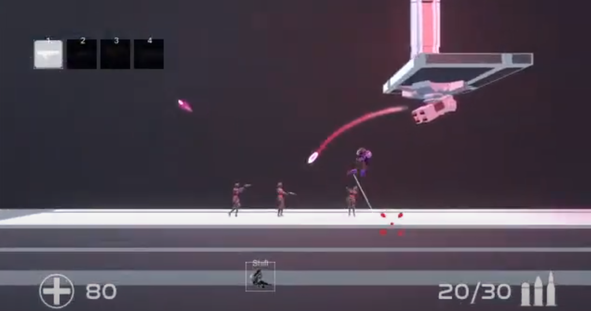
</p>
<b>After</b>
<p align="center">
  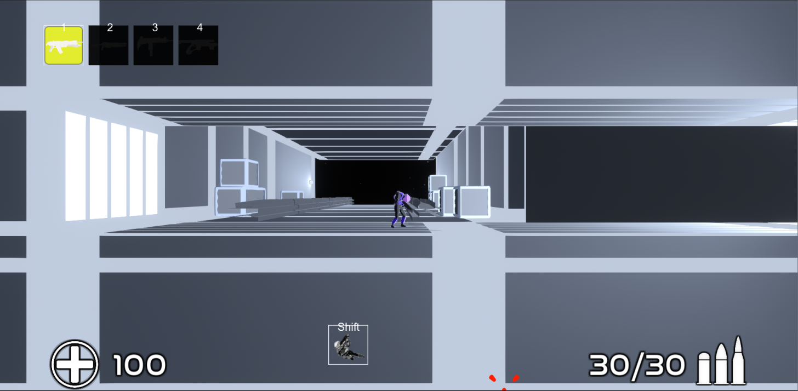
</p>

It was found that players did not know which direction to go in specific areas, so we added arrows in locations where players commonly got lost.
<p align="center">
  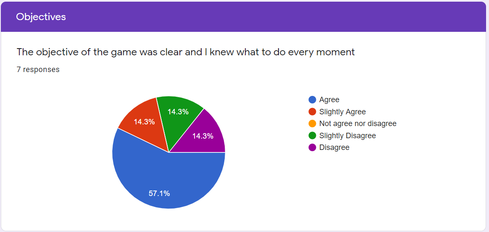
</p>
<p align="center">
  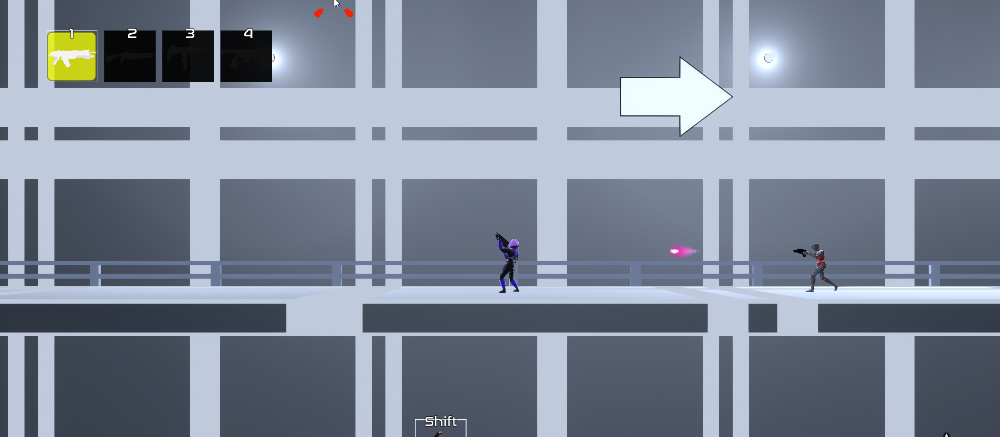
</p>

It was indicated that the weapons the player was given were very unbalanced, with almost every participant suggesting that we 'buff' the shotgun, while leaving the rest of the weapons as they were due to the low amount of responses.
<p align="center">
  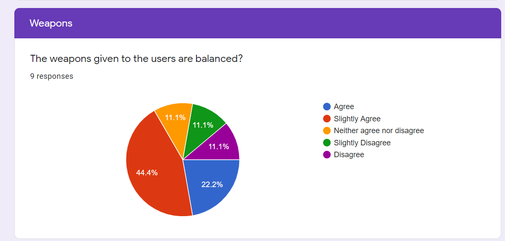
</p>
<p align="center">
  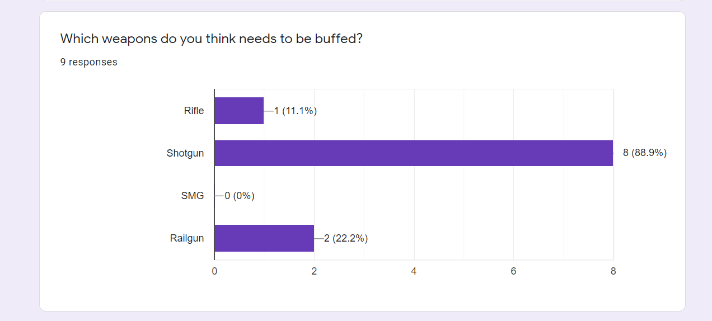
</p>
<p align="center">
  
</p>

Every participant did not have any framerate issues, therefore no optimisation was found to be needed.
<p align="center">
  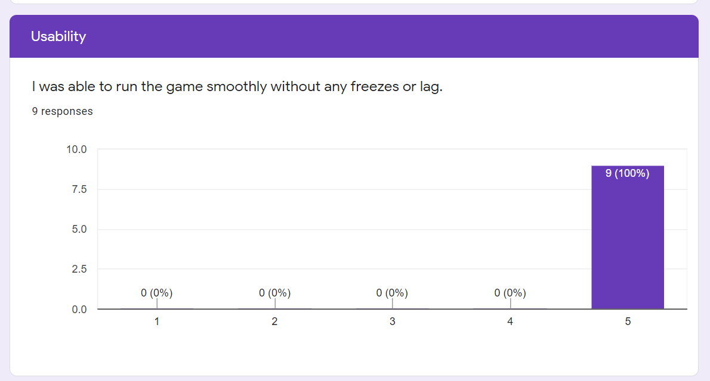
</p>

The majority of participants found that the game's difficulty fell between "Just Right" and "Hard", however, we felt that the participants died too often on the harder levels, so we decided to decrease the difficulty. This was done by adding health packs to the level.
<p align="center">
  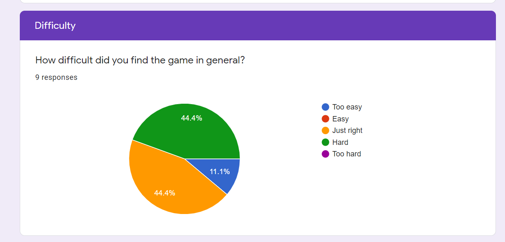
</p>

Most players found that the difficulty increase between level 3 and 4 was too big. So we decided to make a new level that was in between the difficulty of level 3 and 4 to have a much more smoother difficulty increase
<p align="center">
  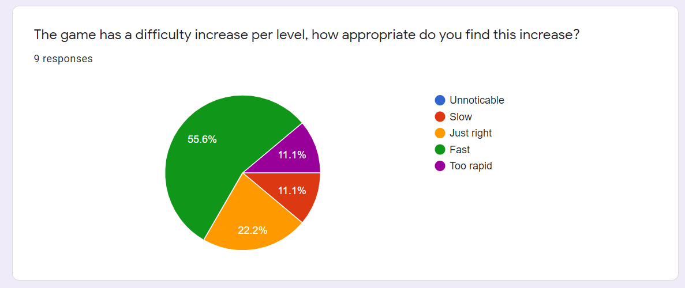
</p>

Some players felt that sliding and wall jumping felt a bit strange, so we decided to improve this by adding the ability to slide while facing the other direction, and to slowly slide down the wall when holding against it.
<p align="center">
  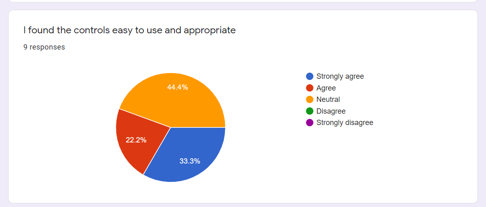
</p>
<p align="center">
  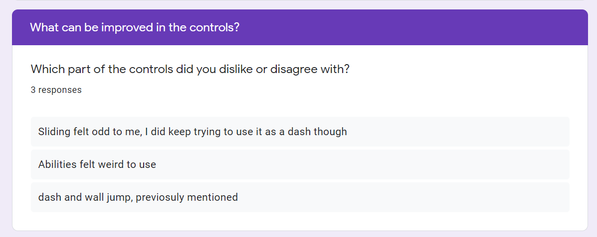
</p>
<p align="center">
  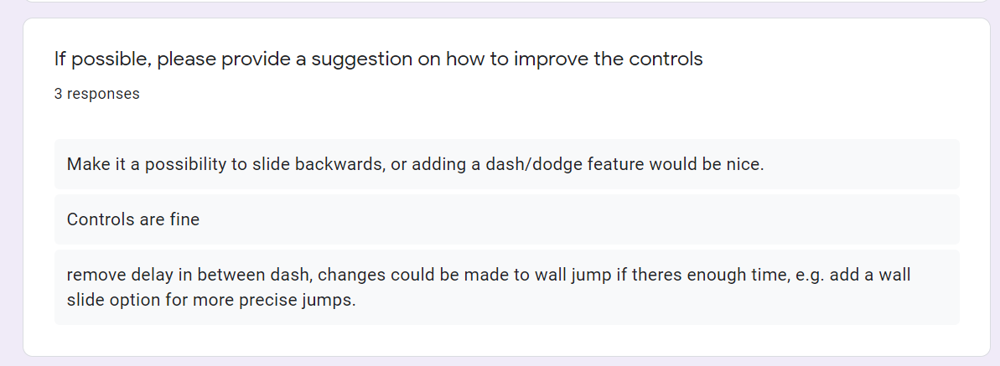
</p>

Many bugs were discovered throughout the process, since we recorded each session, we were able to fix all of the bugs discovered.
<p align="center">
  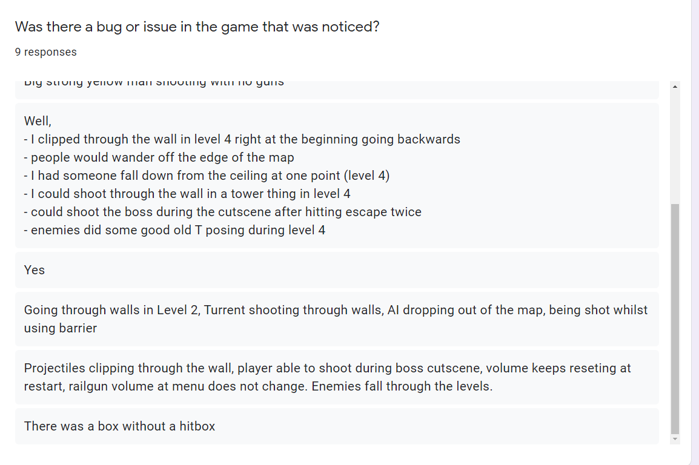
</p>


